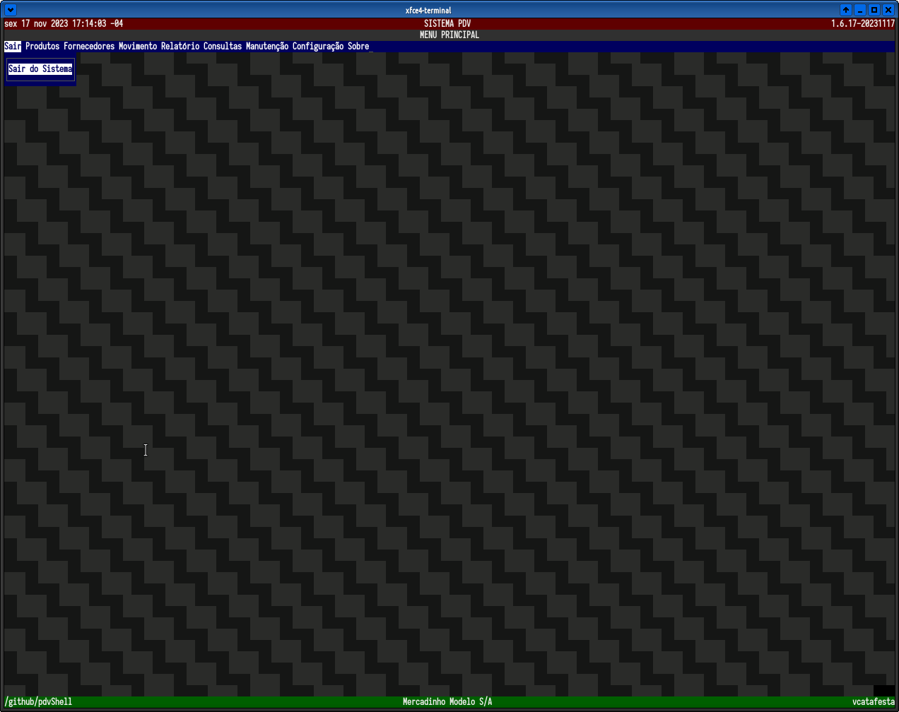
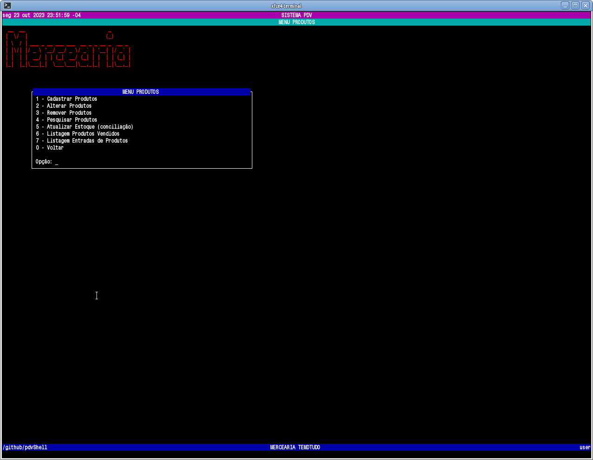
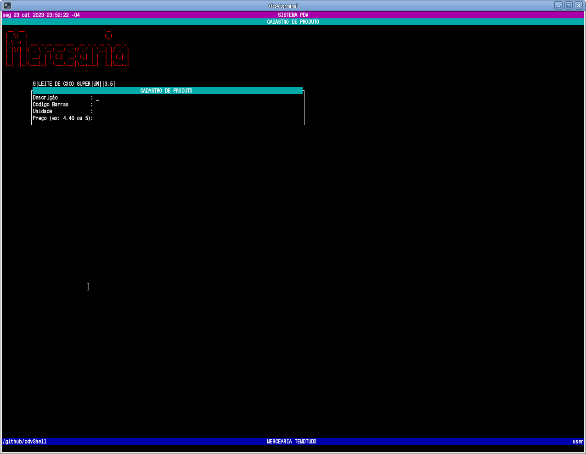
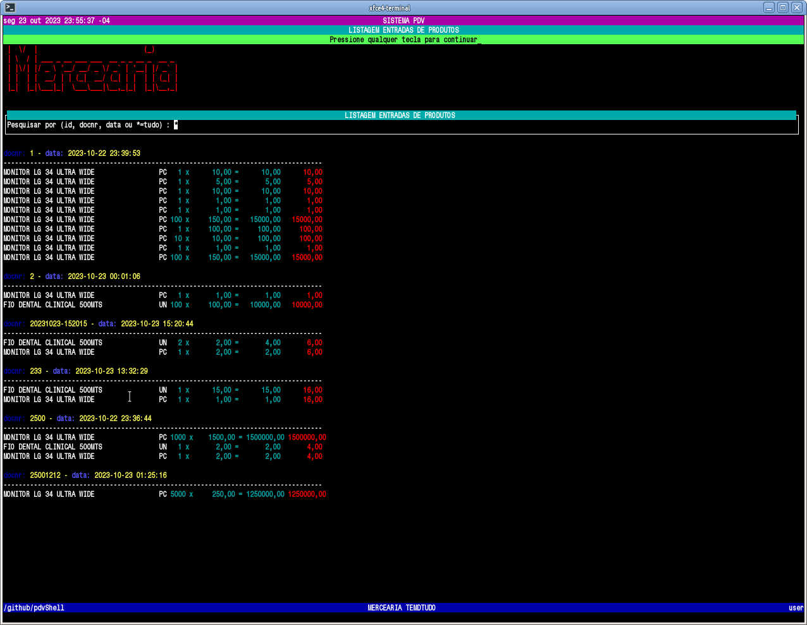
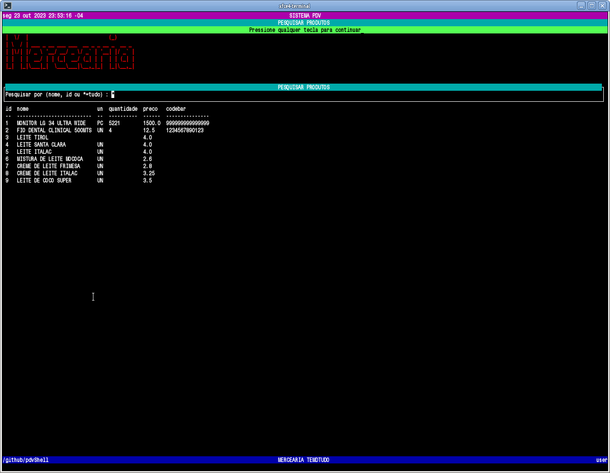
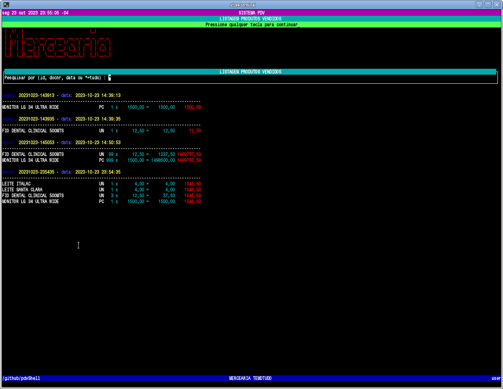
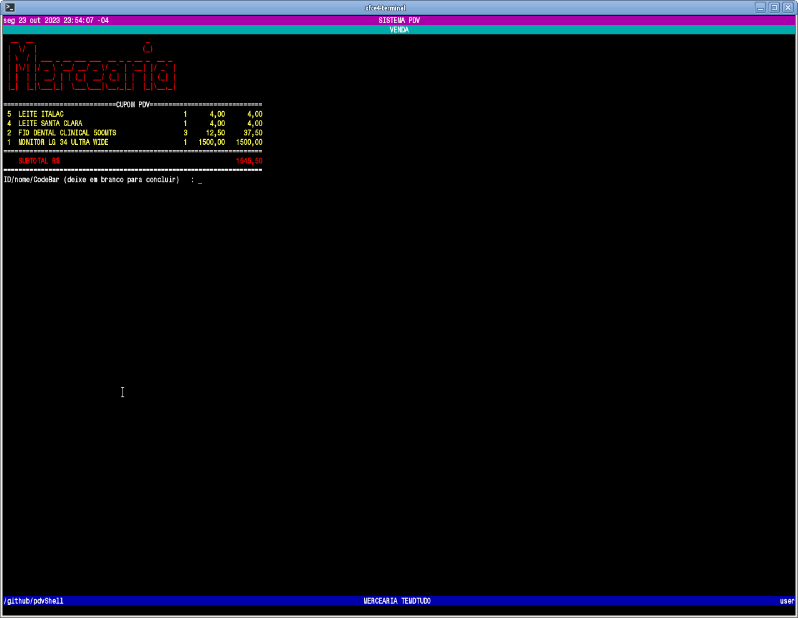
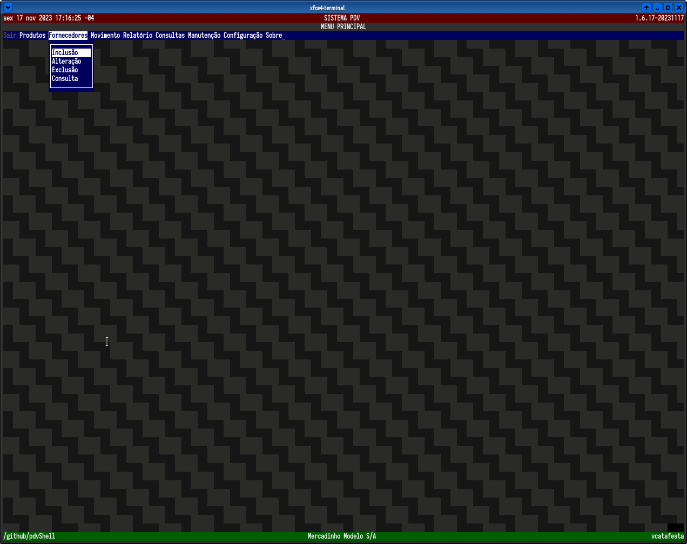

# pdvShell
PDVSHELL, simples frente de caixa para  mercearias pequenas feito em shell script e sqlite!

* Adicionar Novo Produto
* Remover Produto
* Realizar Venda
* Visualizar Todos Produtos
* Exibir vendas Diarias
* Pesquisar Produtos

## Futuras Features
* Adicionar validade do produto
* Suporte a código de barra e Beep

